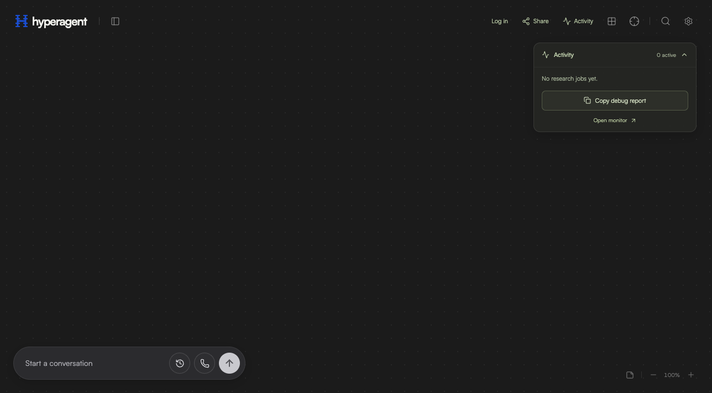

# Hyper Agent

<p>
  <a href="https://react.dev/"></a>
  <a href="https://www.typescriptlang.org/"></a>
  <a href="https://tanstack.com/start"></a>
  <a href="https://vite.dev/"></a>
  <a href="https://tailwindcss.com/"></a>
  <a href="https://www.assistant-ui.com/"></a>
  <a href="https://mastra.ai/"></a>
  <a href="https://neon.tech/"></a>
</p>

<p align="center">
  
</p>

**Hyper Agent is a conversational AI workspace where research becomes a shared, living canvas.** Ask the assistant to research a topic, gather cited sources, and turn the results into context stacks you can reuse in later conversations. Open shared live browser sessions, collaborate on one board, and talk to the assistant by voice.

Try it live at **[hyperagent.lol](https://hyperagent.lol/)**.

## What it does

- **Research that keeps running:** queue background research and watch sources and summaries appear while tools work.
- **A canvas for useful context:** collect citations, summaries, plans, and notes as movable cards; choose which source stacks inform the next prompt.
- **Shared live browsers:** open and operate cloud browser sessions directly on a board with collaborators.
- **Chat and voice:** work with the assistant through text or browser speech, with research and connected services available as tools.
- **A research activity monitor:** inspect job status, tool timings, errors, and redacted debug reports.

## Built with
The app uses **React 19**, **TypeScript**, **TanStack Start/Router**, **Vite**, and **Tailwind CSS 4**. **Assistant UI** provides the chat interface, **Mastra** and the **AI SDK** power the assistant and tools, and **Neon Postgres** stores jobs and shared canvas data. Research runs in a separate **Fly.io** worker; the web app is a Node server on **AWS App Runner**, served through CloudFront. Connected search and service integrations are accessed through Executor MCP.

## Explore the architecture

Open the **[sponsor architecture showcase](https://hyperagent.lol/architecture/index.html)**
for the eight integration stories and three guided flows, or open the
**[full Groma map](https://hyperagent.lol/architecture/map/index.html?theme=dark)**
to inspect components and their source.

Groma and Backlog are pinned **project-local development dependencies**. From
the repository root:

```sh
npm install
npm run architecture:dev       # live Groma map on localhost:4747
npm run architecture:generate  # scan, export the map, regenerate tour steps
npm run backlog -- browser    # optional local Backlog interface
```

Architecture records live in `groma/`; change their meaning with `npm run groma -- edit …`.
Scans preserve authored descriptions, combined components and relationships.
The showcase and static export live in `web/public/architecture/`, so the normal
application deployment publishes them. The export includes the public source
files owned by the map; the scanner excludes tooling, infrastructure and generated
assets. The current scanners do not infer this repo's TanStack/Nitro and Fly
container boundaries, so the map uses responsibility groups and documents the
runtime boundaries in its project overview and showcase.

Official logo provenance is saved in `web/public/architecture/assets/sources.json`.
The presentation describes implemented use: Fly.io Machines, Exa search excerpts,
Mastra agents and optional memory. It does not claim Sprites, full-page crawling
or Mastra Factory integrations. Beads remains the authoritative task tracker;
Backlog is initialized without replacing agent instructions or duplicating tasks.

## Run the application locally

From `web/`:

```sh
npm install
npm run dev
```

The app expects server configuration for Neon, the Executor MCP, and the research worker. See [`web/README.md`](web/README.md) for deployment details, integration settings, browser-agent behavior, and the full architecture. Keep credentials in local ignored environment files or production secret stores.

## Branches and deployment

| Branch | Deploys to | Who pushes here |
|--------|------------|-----------------|
| `dev` (default) | [dev.hyperagent.lol](https://dev.hyperagent.lol/) | Everyone — all day-to-day work lands here |
| `production` | [hyperagent.lol](https://hyperagent.lol/) | **Nobody**, unless specifically told to ship production |

**Rules for agents working in this repo:**

1. **Test locally first** (`npm run dev` from `web/`).
2. **Ship to `dev`.** Merge or push your work to the `dev` branch; GitHub Actions (`deploy-dev.yml`) builds it and deploys dev.hyperagent.lol automatically.
3. **Never touch `production` unless specifically told to.** A production release is an explicit, human-requested act: fast-forward `production` to the commit being released and push; `deploy-production.yml` deploys hyperagent.lol.

Both sites run as AWS App Runner services behind the same ECR repo (`hyperagent-app:dev` / `hyperagent-app:latest`). Dev currently shares the production database and research worker, so schema-destructive experiments still need care. The research worker (Fly.io) deploys with production releases only, or by manual `workflow_dispatch` of `deploy-research.yml`.

This is a hackathon project; the repository intentionally has no test or typecheck gate.
